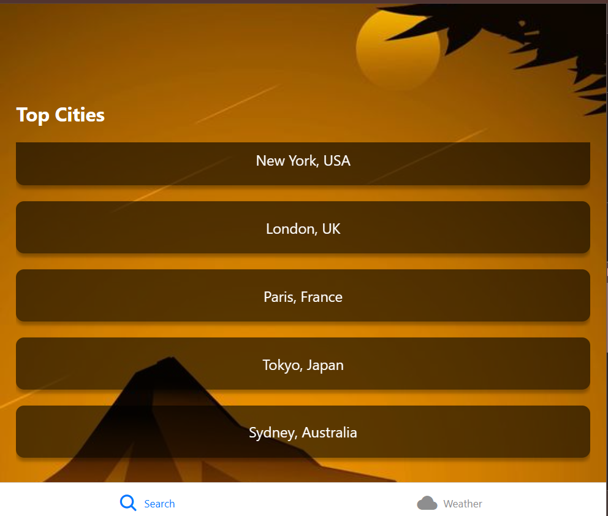
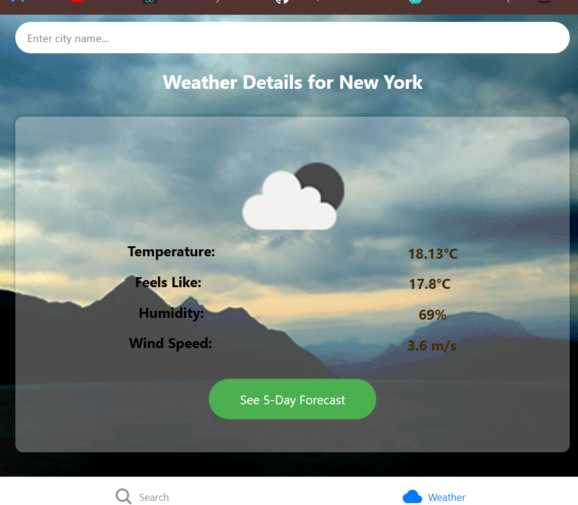
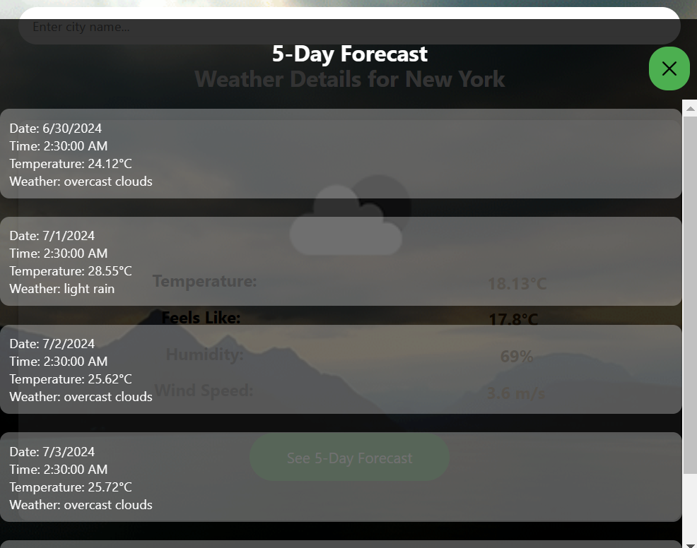

Sure! Here's an updated `README.md` file that includes an Acknowledgment section:

```markdown
# Weather App

A weather application built using React Native Expo that provides current weather details and a 5-day forecast for any city. The app features dynamic background images based on the weather conditions and a modal to display the forecast.


## Table of Contents
- [Features](#features)
- [Setup](#setup)
- [Environment Variables](#environment-variables)
- [Running the App](#running-the-app)
- [Building the APK](#building-the-apk)
- [Web Deployment](#web-deployment)
- [APK Download](#apk-download)
- [Screenshots](#screenshots)
- [Acknowledgment](#acknowledgment)

## Features
- Current weather details for any city
- 5-day weather forecast
- Dynamic background images based on weather conditions
- Responsive and user-friendly interface
- Error handling for city not found

## Setup
1. Clone the repository:
   ```bash
   git clone https://github.com/yourusername/weather-app.git
   cd weather-app
   ```

2. Install dependencies:
   ```bash
   npm install
   ```

## Environment Variables
Create a `.env` file in the root directory and add your OpenWeatherMap API key:
```
API_KEY=your_openweathermap_api_key
```

## Running the App
To run the app on a development server:
```bash
expo start
```

## Building the APK
To build the APK for Android devices:
```bash
expo build:android
```
Follow the instructions provided by Expo to complete the build process. The APK download link will be provided after the build is complete.

## Web Deployment
The app is also deployed as a web application. You can view the web version at:
[Weather App Web](https://weather-ebon-nine.vercel.app/)

## APK Download
You can download the APK from the following link:
[Weather App APK](https://drive.google.com/file/d/1bzMuVu_xHs5O7UnGFuR83LPELrKqnUqf/view?usp=sharing)

## Screenshots
### Main Screen


### Weather Details


### 5-Day Forecast Modal


### City Not Found Screen


## Acknowledgment
We would like to thank the following resources and communities for their support and contributions:
- [OpenWeatherMap API](https://openweathermap.org/api) for providing the weather data.
- [React Native](https://reactnative.dev/) and [Expo](https://expo.dev/) for the framework and development tools.
- [Styled Components](https://styled-components.com/) for CSS-in-JS styling.
- The various authors of the background images and icons used in this project.
- Our mentors and peers for their guidance and support throughout the development of this project.
```

